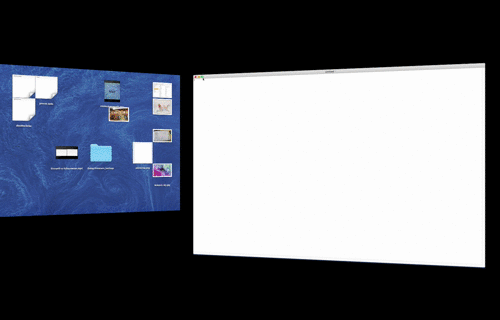

# fullscreenER

# Information:

- Designed for 10.10+
- SIMBL plugin to improve the functionallity of the green maximize button on OS X
- Author: [w0lfschild](https://github.com/w0lfschild)

# Notes:

- All application windows are resizable
- Green maximize button functionality changes
	- Pressing will toggle between zooming to full size of screen and last frame size
	- Pressing while holding option toggles native fullscreen
	- Pressing while in fullscreen exits fullscreen

# Installation:

1. Download [mySIMBL](https://github.com/w0lfschild/app_updates/raw/master/mySIMBL/mySIMBL_master.zip)
2. Download [fullscreenER](https://github.com/w0lfschild/fullscreenER/raw/master/build/fullscreenER.zip)
3. Unzip downloads
4. Open `fullscreenER.bundle` with `mySIMBL.app`
5. Restart Chrome

### License:
Pretty much the BSD license, just don't repackage it and call it your own please!    
Also if you do make some changes, feel free to make a pull request and help make things more awesome!
